# TFCB Week 3 notes

## Migrate State to Terraform Cloud

Using the following will automatically create the workspace and migration any existing state file using `terraform init`

```
terraform {
  cloud {
    organization = "patrickmunne"
    workspaces {
      name = "learn-terraform-cloud-migrate"
    }
  }

  required_providers {
    random = {
      source  = "hashicorp/random"
      version = "3.3.2"
    }
  }
  required_version = ">= 1.1.0"
}
```

# Connect Workspaces with Run Triggers

During this exercise you see that a run in a different workspace is automatically triggered

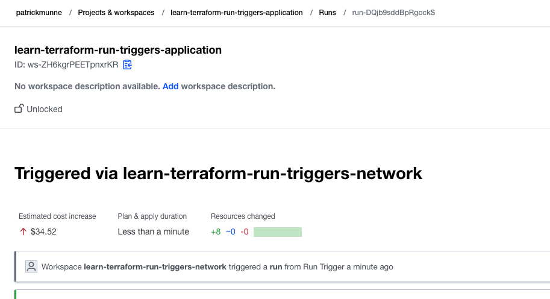  

# Manage Permissions in Terraform Cloud

Creating teams and permissions
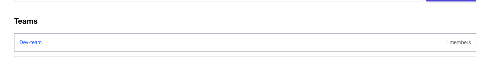    

# Upgrade Terraform Version in Terraform Cloud

it failed on the pull request  
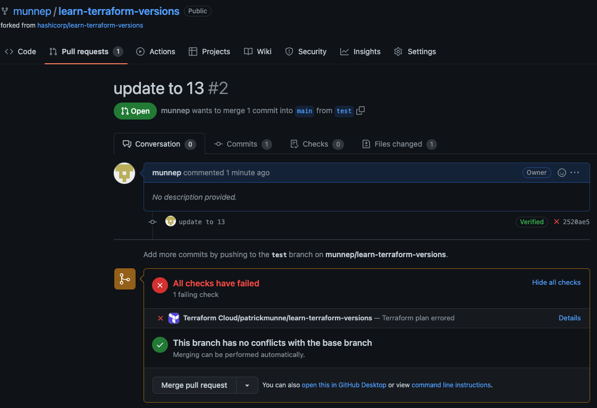  
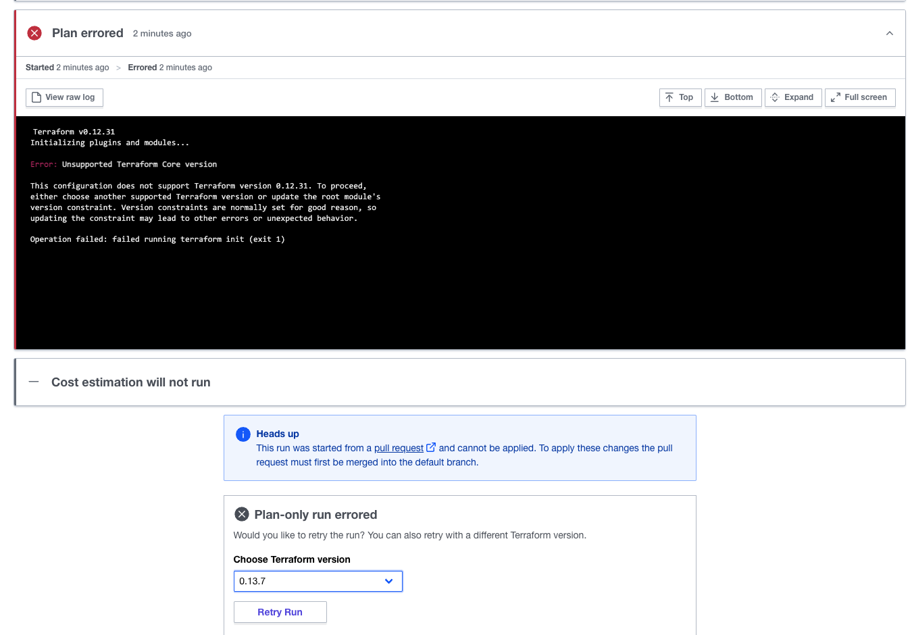    

To make state upgrades you can do an allow empty apply as a run option

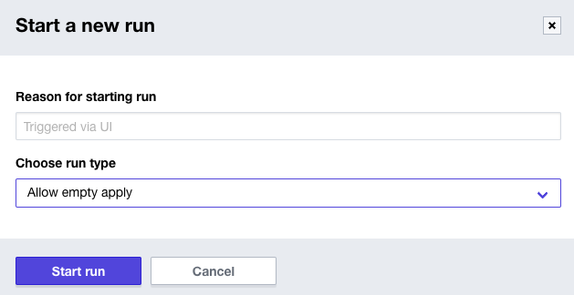    

# Configure GitHub.com Access through OAuth

Did it multiple times last months. 

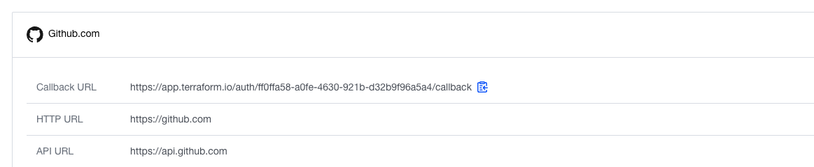    

# Manage Private Environments with Terraform Cloud Agents

you can use a environment file

agent1.list
```
TFC_AGENT_TOKEN=<token>
TFC_AGENT_NAME=agent1
```

Run a local docker environment. The -v is for this docker agent to execute other docker containers
```
docker run --name tfc_agent --env-file agent1.list -v /var/run/docker.sock:/var/run/docker.sock hashicorp/tfc-agent:latest
```

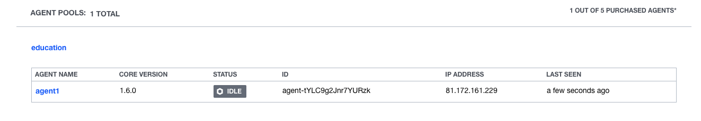    

remember `Each agent is single-threaded and can only execute the work of one run at a time.`

Second agent running
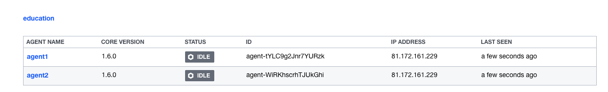    

# Deploy Infrastructure with the Terraform Cloud Operator for Kubernetes

This gives you a better understanding of the operator and where the helm chart comes in. 

# Deploy Consul and Vault on Kubernetes with Run Triggers

The vault was created as well
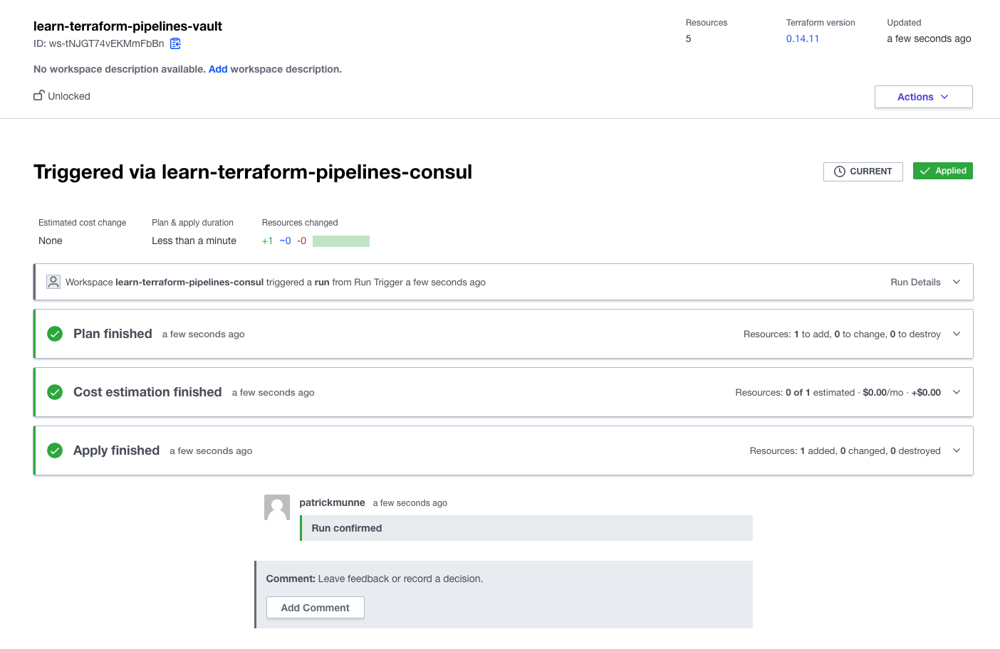    
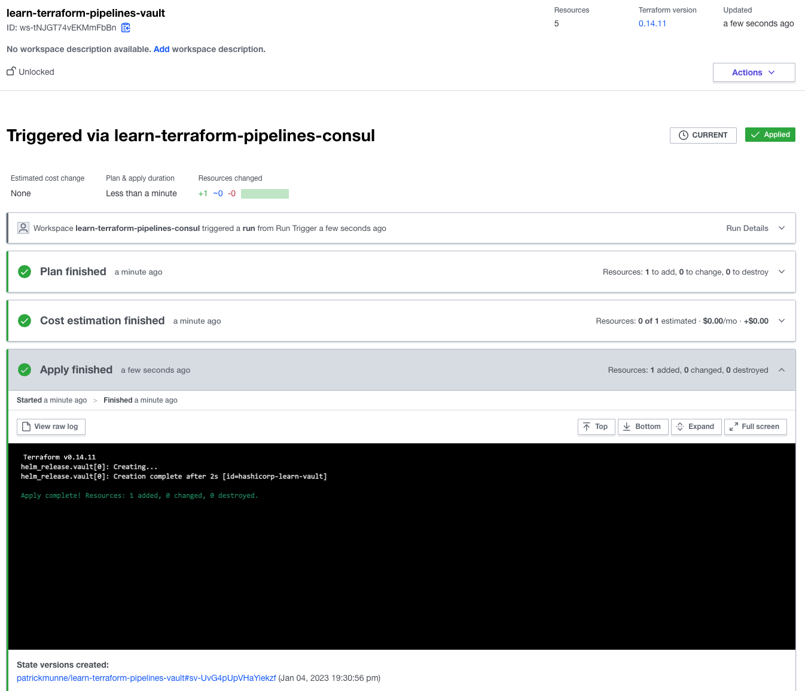    
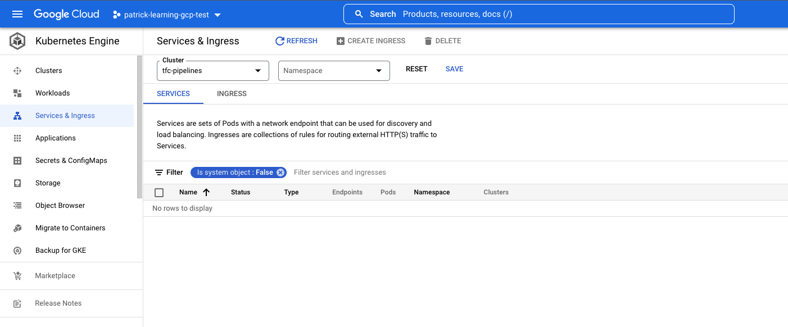    

There is a bug in the exercise. This will be validated by the learning Team of hashicorp

# Automate Terraform Cloud Workflows

This is based on the previous exercise with a bug in it where it cannot complete. This has to be resolved before continuing with this exercise

# Version Remote State with the Terraform Cloud API

How to use the API to download a statefile edit this statefile and upload it again to the same workspace. 

# Terraform Cloud Secrets Engine

This exercise gave a small idea what you can do with Vault and how to give temporary tokens to users. Great to see. 

