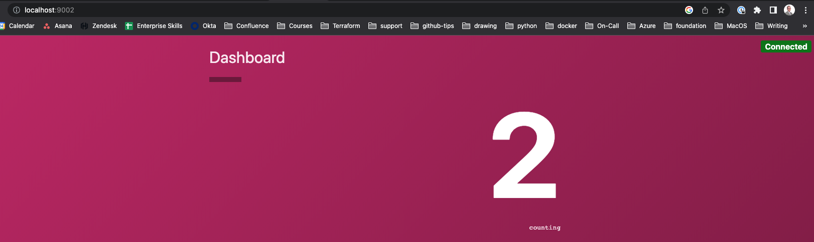
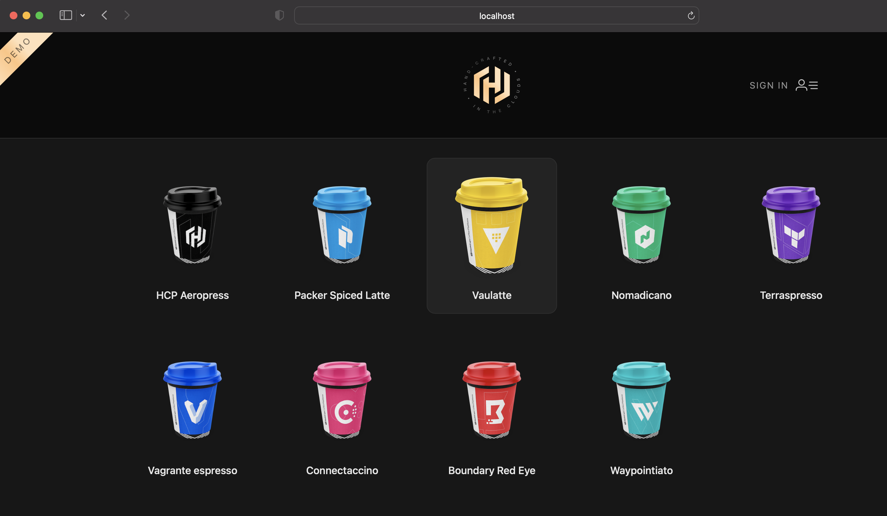
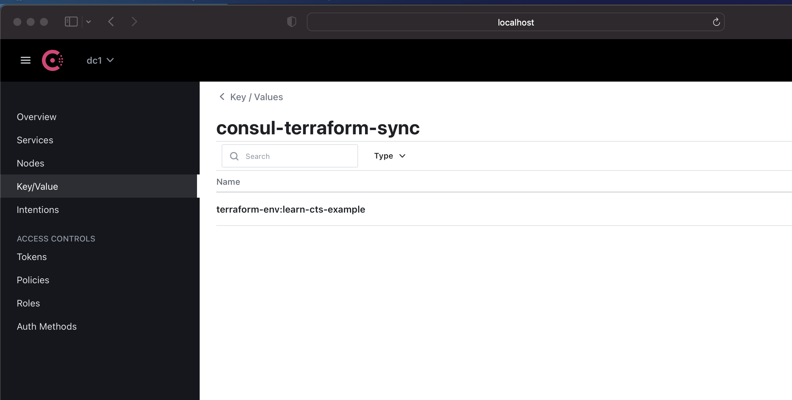
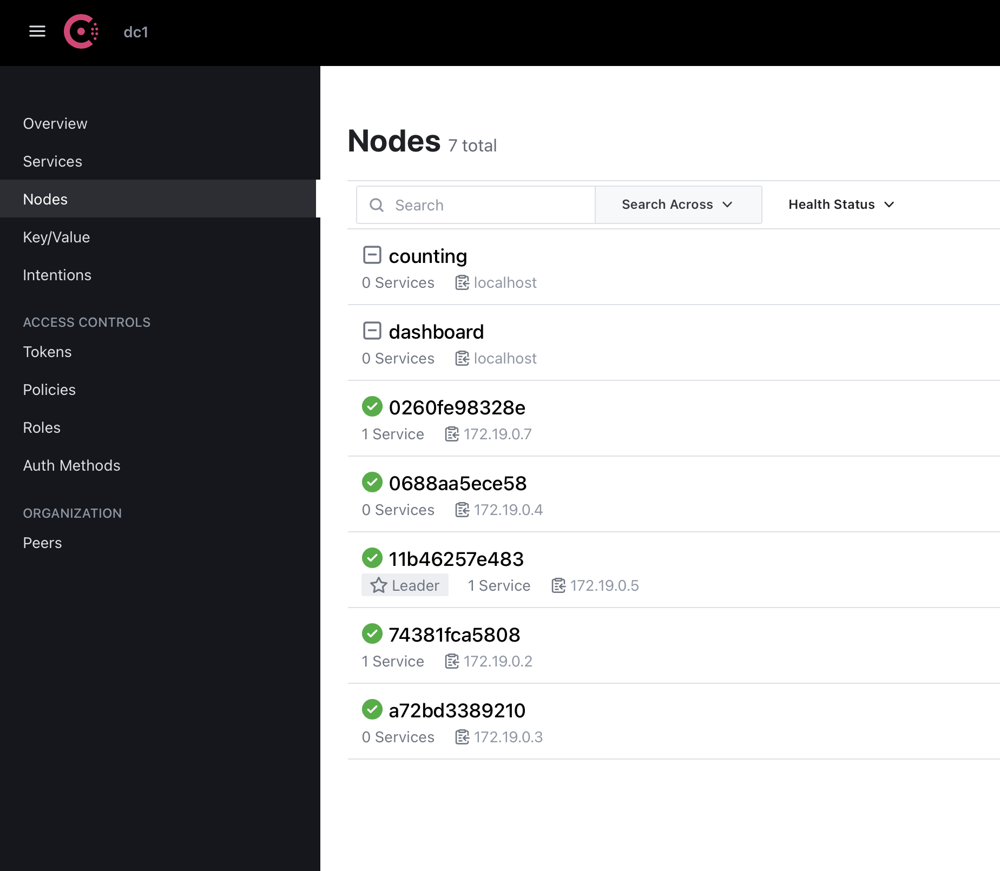
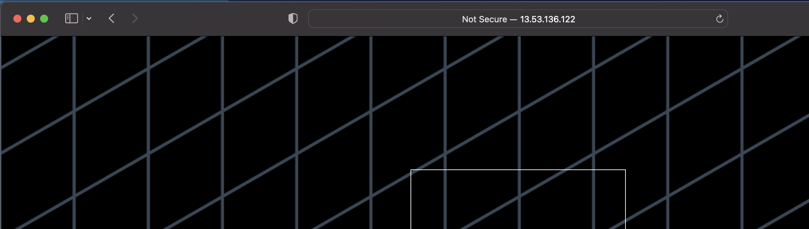
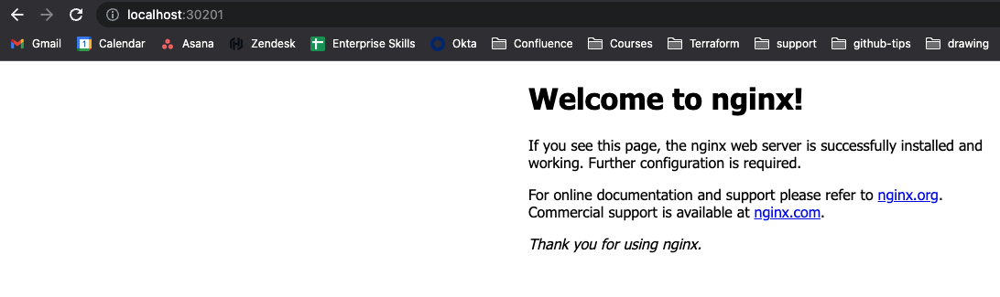

# Deploy Federated Multi-Cloud Kubernetes Clusters
#### https://developer.hashicorp.com/onboarding/tfcb-week-4/multicloud-kubernetes

Issue as it is not working as expected
Asked in the learning channel
https://hashicorp.slack.com/archives/C8DK5PR0B/p1674040094604049

In this exercise we changed 2 things
- The version for the AWS kubernetes module `eks` changed to `version         = "15.1.0"`
- Changed the file under `consul/main.tf`

```
resource "helm_release" "consul_dc1" {
  version    = "1.0.2"

resource "helm_release" "consul_dc2" {
  version    = "1.0.2"  
```

In the end got everything working and saw the consul dashboard as was intended
    

# Codify Management of Vault Using Terraform
#### https://developer.hashicorp.com/onboarding/tfcb-week-4/codify-mgmt-oss

the login at the end succeeds

```
vault login -method=userpass username=student
Password (will be hidden): 
Success! You are now authenticated. The token information displayed below
is already stored in the token helper. You do NOT need to run "vault login"
again. Future Vault requests will automatically use this token.

Key                    Value
---                    -----
token                  hvs.CAESIHh4qVBr0R5B-kVdI47TlCkbs_7wWIlRo85FSd79RADEGh4KHGh2cy5LRWRsN0V3eUNCRmpHb2dvc3ZIb2pQVVA
token_accessor         tDQhSkb0g1wmxq8C3urf86CE
token_duration         768h
token_renewable        true
token_policies         ["admins" "default" "eaas-client"]
identity_policies      []
policies               ["admins" "default" "eaas-client"]
token_meta_username    student
```

# Codify Management of Vault Enterprise Using Terraform  - NEED TO RETRY
#### https://developer.hashicorp.com/onboarding/tfcb-week-4/codify-mgmt-enterprise

Getting errors. Need to take a look with Daniela. 

# approle with Terraform and Chef   - NEED TO RETRY
#### https://developer.hashicorp.com/onboarding/tfcb-week-4/approle-trusted-entities

for step3 did the following
https://developer.hashicorp.com/vault/tutorials/getting-started/getting-started-deploy#initializing-the-vault

Issue which shows it is now working. Asked the learning team again. 
https://hashicorp.slack.com/archives/C8DK5PR0B/p1674636324307559

The education team replied they will take a look at this. 


# Deploy Consul and Vault on Kubernetes with Run Triggers
#### Same exercise as in week 3. Skipping as they are still working on this

# Network Infrastructure Automation with Consul-Terraform-Sync Intro
#### https://developer.hashicorp.com/onboarding/tfcb-week-4/consul-terraform-sync-intro

Install the correct consul-k8s

```
 export VERSION=0.44.0 && \
    curl --location "https://releases.hashicorp.com/consul-k8s/${VERSION}/consul-k8s_${VERSION}_darwin_amd64.zip" --output consul-k8s-cli.zip
  % Total    % Received % Xferd  Average Speed   Time    Time     Time  Current
                                 Dload  Upload   Total   Spent    Left  Speed
100 24.7M  100 24.7M    0     0  8520k      0  0:00:02  0:00:02 --:--:-- 8517k


unzip -o consul-k8s-cli.zip -d ~/.consul-k8s
Archive:  consul-k8s-cli.zip
  inflating: /Users/patrickmunne/.consul-k8s/consul-k8s  

export PATH=$PATH:$HOME/.consul-k8s/

consul-k8s version                          
    consul-k8s v0.44.0
````

Hashicups  
    

Final command worked with scaling up

```
for x in sync-tasks/learn-cts-example/*.txt; do echo "$x: "; cat $x; echo; done
sync-tasks/learn-cts-example/frontend.txt: 
10.0.1.202
10.0.3.151
sync-tasks/learn-cts-example/public-api.txt: 
10.0.2.150
```

# Consul-Terraform-Sync Run Modes and Status Inspection
#### https://developer.hashicorp.com/onboarding/tfcb-week-4/consul-terraform-sync-run-and-inspect

Use the previous exercise to get the basis

You can see the status using the curl command

```
curl --silent localhost:8558/v1/status | jq
{
  "task_summary": {
    "status": {
      "successful": 1,
      "errored": 0,
      "critical": 0,
      "unknown": 0
    },
    "enabled": {
      "true": 1,
      "false": 0
    }
  }
}
```

You can use consul as a backend for your terraform state files

To get to the consul UI do the following

- Create a port forward
```
 kubectl port-forward consul-server-0 8500:8500 --namespace consul
```
- Then go to the localhost:8500
- Login using the root token
- See the output

    

# Use Terraform to Register External Services
#### https://developer.hashicorp.com/onboarding/tfcb-week-4/terraform-consul-provider

At the end terraform added the extra resources to consul dashboard
  

# Provision Infrastructure with Packer
#### https://developer.hashicorp.com/onboarding/tfcb-week-4/packer

Created the packer image and checked the website at the end of the exercise

    

# Manage VMs and Snapshots on vSphere  - NEED TO RETRY
#### https://developer.hashicorp.com/onboarding/tfcb-week-4/vsphere-provider

Couldn't finish because I don't have a Vsphere environment


# Deploy Infrastructure with the Terraform Cloud Operator for Kubernetes
#### https://developer.hashicorp.com/onboarding/tfcb-week-4/kubernetes-operator

Same as we did in week 3

# https://developer.hashicorp.com/onboarding/tfcb-week-4/kubernetes-provider
#### https://developer.hashicorp.com/onboarding/tfcb-week-4/kubernetes-provider

Nginx is available on the local kubernetes cluster  
    

# Deploy Applications with the Helm Provider   - NEED TO RETRY
#### https://developer.hashicorp.com/onboarding/tfcb-week-4/helm-provider
 
Not able to do the final steps as slack doesn't allow me to install this 

export TF_VAR_slack_app_token="1password"


Had to alter the following

# Retrieve EKS cluster configuration
data "aws_eks_cluster" "cluster" {
  name = data.terraform_remote_state.eks.outputs.cluster_name
}

data "aws_eks_cluster_auth" "cluster" {
  name = data.terraform_remote_state.eks.outputs.cluster_name
}

```
Then got the following error
╷
│ Error: chart "kubewatch" not found in https://charts.bitnami.com/bitnami repository
│ 
│   with helm_release.kubewatch,
│   on helm_release.tf line 13, in resource "helm_release" "kubewatch":
│   13: resource "helm_release" "kubewatch" {
```

Asked in the education channel
https://hashicorp.slack.com/archives/C8DK5PR0B/p1675257317009279

Answer is this is a known issue. They will update the exercise

# Automate Monitoring with the Terraform Datadog Provider  - NEED TO RETRY
#### https://developer.hashicorp.com/onboarding/tfcb-week-4/datadog-provider

The helm_release for datadog fails. Reason unknown. I asked in the education channel
https://hashicorp.slack.com/archives/C8DK5PR0B/p1675933583473059


# Use Application Load Balancers for Blue-Green and Canary Deployments
#### https://developer.hashicorp.com/onboarding/tfcb-week-4/blue-green-canary-tests-deployments

After setting a canary test where 10% will go to green and 90% to blue you can see from the output this works

```
for i in `seq 1 10`; do curl $(terraform output -raw lb_dns_name); done
version 1.0 - #1!
version 1.0 - #0!
version 1.1 - #1!
version 1.0 - #0!
version 1.0 - #1!
version 1.0 - #0!
version 1.0 - #0!
version 1.0 - #1!
version 1.1 - #1!
version 1.0 - #1!
```

# Host a Static Website with S3 and Cloudflare
#### https://developer.hashicorp.com/onboarding/tfcb-week-4/cloudflare-static-website


