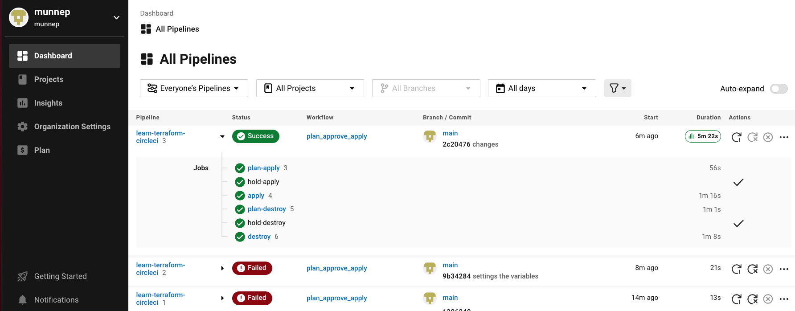
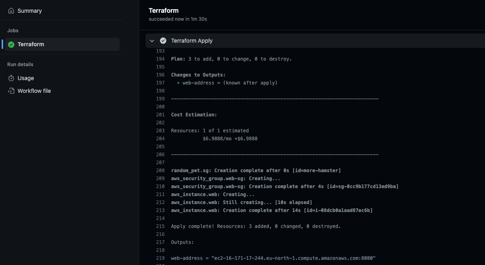

# Benefits and Connecting to VCS providers
#### https://developer.hashicorp.com/onboarding/tfcb-week-6/tfcb-w6-benefits-vcs

Just an overview to read and we did this a lot during the Skills Matrix exercises.

# Running Terraform in Automation
#### https://developer.hashicorp.com/onboarding/tfcb-week-6/automate-terraform

We have the environment variable `TF_IN_AUTOMATION`. More details [here](https://developer.hashicorp.com/terraform/cli/config/environment-variables#tf_in_automation)

If TF_IN_AUTOMATION is set to any non-empty value, Terraform adjusts its output to avoid suggesting specific commands to run next. This can make the output more consistent and less confusing in workflows where users don't directly execute Terraform commands, like in CI systems or other wrapping applications.

Terraform accesses the following environment variables to configure the configuration's cloud block:
- Use TF_CLOUD_ORGANIZATION for the organization name
- Use TF_CLOUD_HOSTNAME for the hostname if using Terraform Enterprise
- Use TF_WORKSPACE for the workspace to operate in
- Use TF_TOKEN_<hostname> for the Terraform Cloud token to use to authenticate operations. Name the variable TF_TOKEN_app_terraform_io for Terraform Cloud, or update the hostname with your Terraform Enterprise endpoint, replacing any periods with underscores.

# Deploy Infrastructure with Terraform and CircleCI
#### https://developer.hashicorp.com/onboarding/tfcb-week-6/circle-ci

Because of the CfgMgmt Camp 2023 I knew a little bit about CircleCI. Because we can't store the AWS credentials in CircleCI I did the following

- Terraform cloud workspace remote execution
- Added the AWS credentials to TFC workspace
- Changed the .circleci/config yaml a bit so it would execute properly
- After this it worked  

    

# Automate Terraform with GitHub Actions
#### https://developer.hashicorp.com/onboarding/tfcb-week-6/github-actions

I had no idea this was possible. This was so great to do. Even though there was an error in the configuration yaml file but I was able to figure this one out. Created a pull request for this to fix it, but got rejected by an automated process. I then created in issue on the repo with the required details. 

    

# Automate Terraform Cloud Workflows
#### https://developer.hashicorp.com/onboarding/tfcb-week-6/tfe-provider-run-triggers

Same exercise as in week 3. This didn't work and the education team is looking into it. 

# Provision Infrastructure with Cloud-Init
#### https://developer.hashicorp.com/onboarding/tfcb-week-6/cloud-init

Saw they used the older data template_file instead of templatefile. Made the change and it worked

```
  user_data                   = templatefile("../scripts/add-ssh-web-app.yaml",{})
```

# Provision Infrastructure with Packer
#### https://developer.hashicorp.com/onboarding/tfcb-week-6/packer

Same exercise as in week 4 which worked


