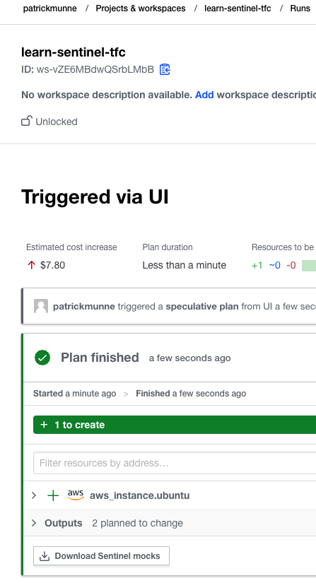
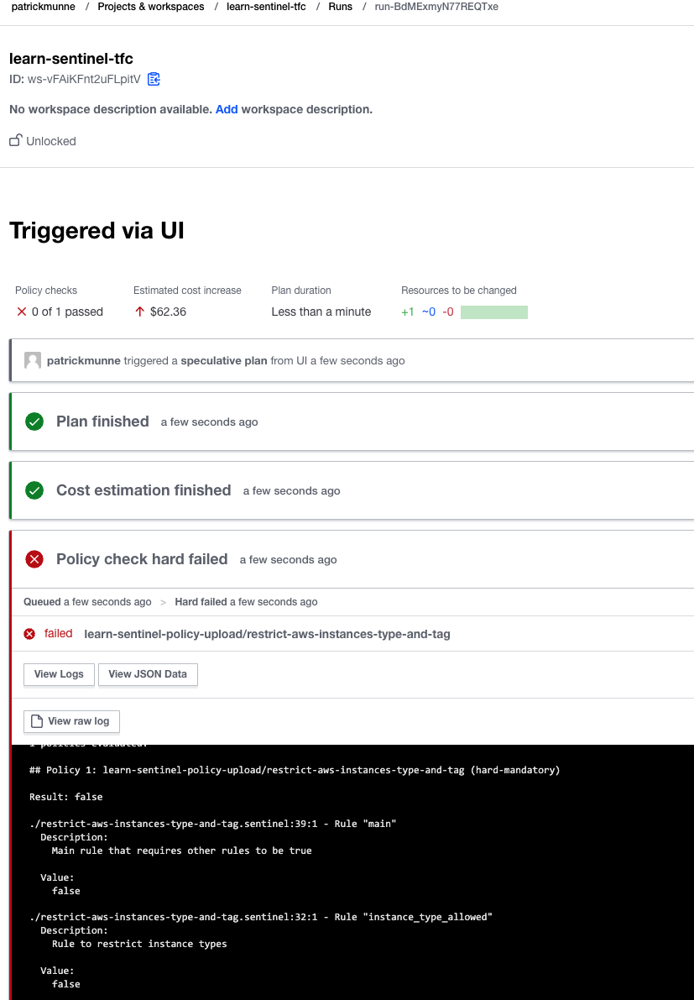
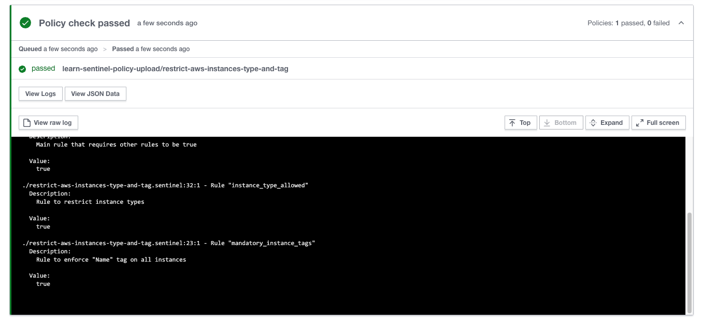
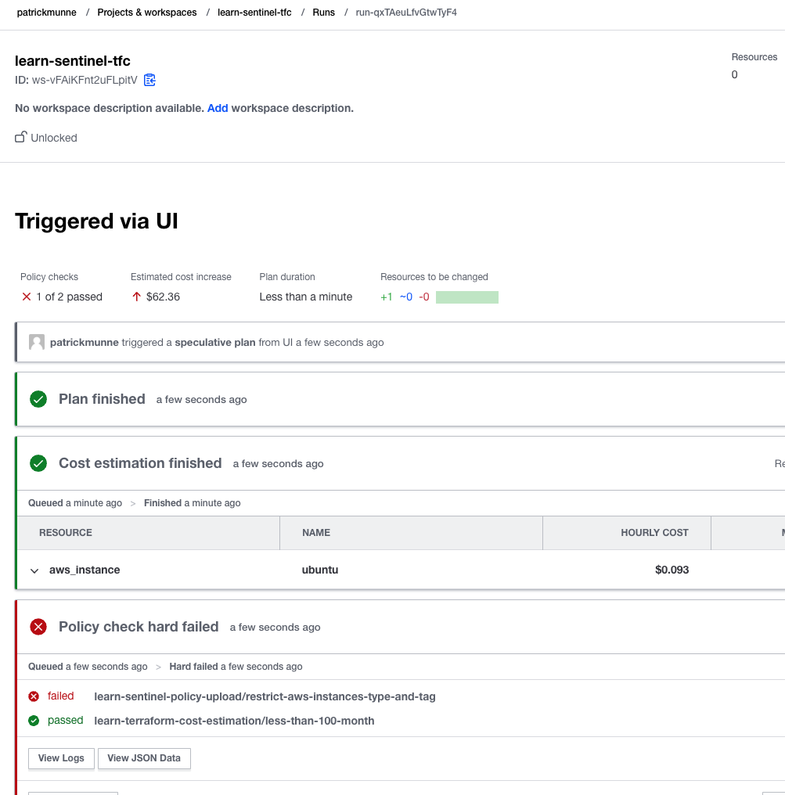

# Manage Private Environments with Terraform Cloud Agents
#### https://developer.hashicorp.com/onboarding/tfcb-week-7/cloud-agents

Same as the exercise in week 3

# Single Sign On
#### https://developer.hashicorp.com/onboarding/tfcb-week-7/tfcb-w7-sso

No exercise just reading

# 2 Factor Authentication (2FA)
#### https://developer.hashicorp.com/onboarding/tfcb-week-7/tfcb-w7-2fa

No exercise just reading

# Managing Workspace Access
#### https://developer.hashicorp.com/onboarding/tfcb-week-7/tfcb-w7-manage-workspace-access

No exercise just reading

# Install the Sentinel CLI
#### https://developer.hashicorp.com/onboarding/tfcb-week-7/sentinel-install

Got the Sentinel tool installed and tested the exercise

# Generate Policy Mock Data
#### https://developer.hashicorp.com/onboarding/tfcb-week-7/sentinel-import

Downloaded the sentinel mock files    

    

# Write a Sentinel Policy for a Terraform Deployment
#### https://developer.hashicorp.com/onboarding/tfcb-week-7/sentinel-policy

Good to see how to test a policy against mock data

# Test Sentinel Policies
####  https://developer.hashicorp.com/onboarding/tfcb-week-7/sentinel-testing

Good to see it with a test option using

```
sentinel test -verbose restrict-aws-instances-type-and-tag.sentinel
Installing test modules for test/restrict-aws-instances-type-and-tag/fail.hcl
Installing test modules for test/restrict-aws-instances-type-and-tag/pass.hcl

PASS - restrict-aws-instances-type-and-tag.sentinel
  PASS - test/restrict-aws-instances-type-and-tag/fail.hcl

    trace:
      restrict-aws-instances-type-and-tag.sentinel:39:1 - Rule "main"
        Description:
          Main rule that requires other rules to be true

        Value:
          false

      restrict-aws-instances-type-and-tag.sentinel:32:1 - Rule "instance_type_allowed"
        Description:
          Rule to restrict instance types

        Value:
          false
  PASS - test/restrict-aws-instances-type-and-tag/pass.hcl

    trace:
      restrict-aws-instances-type-and-tag.sentinel:39:1 - Rule "main"
        Description:
          Main rule that requires other rules to be true

        Value:
          true

      restrict-aws-instances-type-and-tag.sentinel:32:1 - Rule "instance_type_allowed"
        Description:
          Rule to restrict instance types

        Value:
          true

      restrict-aws-instances-type-and-tag.sentinel:23:1 - Rule "mandatory_instance_tags"
        Description:
          Rule to enforce "Name" tag on all instances

        Value:
          true
```

# Upload Your Sentinel Policy Set to Terraform Cloud
#### https://developer.hashicorp.com/onboarding/tfcb-week-7/sentinel-cloud-integration

You will see a failed check during the plan because our instance type is t2.large

    


changing it to t2.micro  

    

# Control Costs with Policies
#### https://developer.hashicorp.com/onboarding/tfcb-week-7/cost-estimation

You have a policy on the costs

    


# Application and Audit Logs
#### https://developer.hashicorp.com/onboarding/tfcb-week-7/tfcb-w7-app-and-audit-logs

There are two types of logs, Application Logs and Audit Logs. Application logs emit information about the services that comprise Terraform Cloud. Audit logs emit information whenever any resource managed by Terraform Cloud is changed.

